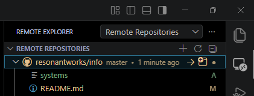

# Visual Studio Code

- [Visual Studio Code](#visual-studio-code)
  - [Remote open GitHub repository](#remote-open-github-repository)

## Remote open GitHub repository

1. Click the *Remote Explorer* icon in the Activity Bar (left sidebar)
1. Change the dropdown menu at the top to *Remote Repositories*
1. Click the plus `+` icon or the *Open Remote Repository* button
1. Select *Open Repository* from *GitHub*
1. Authenticate your GitHub account if prompted
1. Search for your repository by name or paste its URL and press *Enter*

